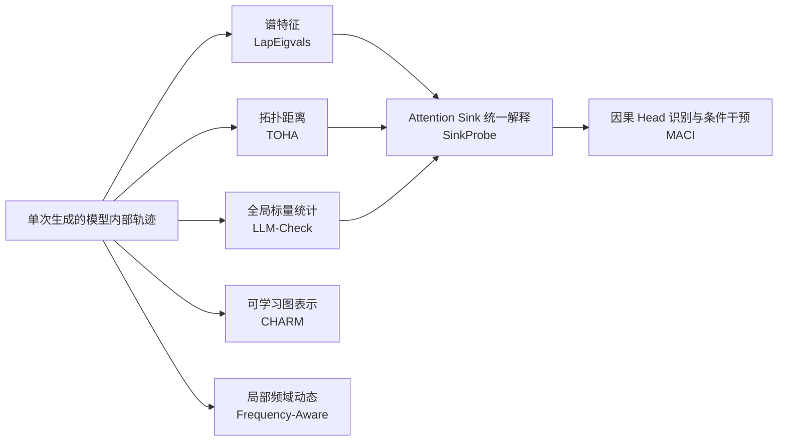

# 基于模型内部注意力信号的幻觉检测：近期文献综述

> **整理时间：2026 年 7 月 20 日**  
> **范围：** 重点讨论无需外部检索、主要依靠单次生成中的 attention、hidden activation、图结构或因果干预进行 hallucination detection / mitigation 的工作。  
> **核心问题：** 这些方法具体提取什么信号、用哪些 benchmark、报告什么指标、结果如何，以及论文如何组织研究故事。

---

## 1. 执行摘要

近期基于模型内部状态的幻觉检测，大致经历了以下演进：

1. **全局标量统计：**  
   LLM-Check 用 attention matrix、hidden states 和输出概率的 log-determinant、entropy 等统计量判断整段回答是否幻觉，突出单次生成和低成本。

2. **谱与拓扑图特征：**  
   Spectral Features 将 attention map 看作图，提取图 Laplacian 的特征值；TOHA 则直接测量回答 token 相对于 prompt token 的拓扑脱离程度。

3. **可学习的图表示：**  
   CHARM 不再手工压缩 attention map，而是把 token 和 attention flow 构造成 attributed graph，用 GNN 学习 token-level 或 response-level detector。

4. **局部动态和 span 定位：**  
   Frequency-Aware Attention 将连续生成步骤中的 attention 看成离散信号，用 Fourier、Wavelet 和离散 Laplacian 检测高频、碎片化的 grounding，从整段检测推进到 token/span-level 检测。

5. **统一机制解释：**  
   SinkProbe 指出多种看似不同的 attention detector，实际都在不同程度上测量 attention concentration 或 attention sink。它用更直接的 sink score 获得了更简单且通常更强的 detector。

6. **从相关性走向因果干预：**  
   MACI 使用 path patching 区分 hallucination-driving 与 hallucination-resisting heads，再由 resisting heads 检测模态冲突，并有条件地关闭 driving heads，实现检测与 mitigation 的闭环。

总体来看，主流评估指标不是单独的 accuracy，而是：

- **AUROC：** response-level detector 最常用；
- **AUPR：** token/span-level、正负样本不平衡时尤其重要；
- **F1：** 需要给出实际分类阈值时常用；
- **TPR@低 FPR：** 面向部署时有价值；
- **Hallucination Rate + 正常任务 Accuracy：** mitigation 方法必须同时报告两者，避免只通过破坏模型能力来降低幻觉。

> **核心研究空缺：** 现有方法大多只能说明“整个回答看起来像幻觉”，但很难回答“哪个 evidence span 驱动了错误、对它做干预后答案是否按预期变化”。因此，将 **行为干预确定候选 span** 与 **span-level attention features** 结合，并用测试时干预做因果验证，是一条清晰且尚未被充分覆盖的研究方向。

---

## 2. 文献选择标准

本文献综述以以下条件筛选工作：

- 主要依赖模型内部信号，而非外部知识库、搜索引擎或检索增强；
- 尽量只需一次主模型生成，避免依赖大量自一致性采样；
- 使用 attention、hidden states、logits、图结构或 activation intervention；
- 任务目标是 hallucination detection、localization 或 mitigation；
- 优先选择 2024–2026 年公开论文。

本文重点比较 5 篇与 attention-graph / spectral 路线最接近的论文，并加入两篇重要的前置和扩展工作：

- 前置工作：**LLM-Check**
- 核心 5 篇：
  1. **Spectral Features of Attention Maps**
  2. **TOHA**
  3. **CHARM**
  4. **Frequency-Aware Attention**
  5. **SinkProbe**
- 因果 mitigation 扩展：**MACI**

---

## 3. 方法路线图

不同方法的核心分歧不是“是否使用 attention”，而是：

- 将 attention 压缩成一个标量，还是保留完整结构；
- 做 response-level 分类，还是 token/span-level 定位；
- 仅利用统计相关性，还是进一步进行内部干预；
- 追求 detector 性能，还是追求机制解释和可操作的 mitigation。

---

## 4. 总体对比

| 方法 | 核心信号 | 检测粒度 | 分类器或评分器 | 主要指标 | 主要 benchmark |
|---|---|---:|---|---|---|
| LLM-Check | Attention/hidden log-det、输出概率 | Response | 标量分数或轻量分类器 | AUROC、Accuracy、F1、AUPR、TPR@5%FPR | FAVA、SelfCheckGPT/WikiBio、RAGTruth |
| Spectral Features | Attention graph Laplacian top-\(k\) eigenvalues | Response | PCA + Logistic Regression | AUROC | CoQA、GSM8K、HaluEvalQA、NQ-Open、SQuADv2、TriviaQA、TruthfulQA |
| TOHA | Prompt-response attention topology divergence | Response | Head selection + 分数聚合 | ROC-AUC | RAGTruth、CoQA、SQuAD、XSum、HotpotQA |
| CHARM | Attention attributed graph + optional activations | Token / Response | GNN / message passing | AUROC、AUPR | NQ、CNN/DM、Movies、WinoBias、Math |
| Frequency-Aware | Fourier/Wavelet 高频 attention grounding 信号 | Token / Span | Logistic Regression | AUROC、F1 | RAGTruth、HalluRAG |
| SinkProbe | Top-\(k\) attention sink scores | Response | Logistic Regression | ROC-AUC | GSM8K、UMWP、HaluEvalQA、NQ-Open、SQuADv2、TriviaQA、TruthfulQA |
| MACI | Causal driving/resisting heads | 输入冲突检测 + 生成干预 | Lasso probe + conditional zero ablation | Detector AUROC；Hallucination Rate；Accuracy | MMMC、SCI-SemanticConflict |

> **不可直接横向比较提醒：** 各论文使用的模型、数据划分、幻觉标签构造、生成长度和 judge 不同。表中的绝对数字只能用于理解单篇论文内部的相对改进，不能视为严格统一排行榜。

---

# 5. 逐篇分析

## 5.1 LLM-Check：从单次生成的内部统计量检测幻觉

**论文：** *LLM-Check: Investigating Detection of Hallucinations in Large Language Models*  
**发表：** NeurIPS 2024  
**定位：** 后续 attention spectral / graph detector 的重要前置工作。

### 5.1.1 核心方法

LLM-Check 希望避免两类高成本方案：

- 调用外部检索或事实核查系统；
- 对同一问题多次采样，再根据答案一致性判断幻觉。

它从一次生成中提取三类内部信号：

1. **Attention Score**  
   对不同层和 head 的 attention matrix 计算平均 log-determinant。由于 causal attention matrix 是下三角结构，其 determinant 与对角元素相关，因此计算成本较低。

2. **Hidden Score**  
   从 hidden-state matrix、Gram matrix 或奇异值谱中构造几何统计量。

3. **Output features**  
   使用 token probability、perplexity、entropy 等输出分布特征。

它同时讨论：

- **White-box：** 直接读取目标模型内部状态；
- **Black-box：** 将黑盒模型的回答 teacher-force 给辅助开源模型，再读取辅助模型内部状态。

### 5.1.2 Benchmark

- **FAVA-Annotation：** 单回答、无外部 reference；
- **SelfCheckGPT / WikiBio：** 多回答、事实一致性检测；
- **RAGTruth：** 有上下文的 RAG / summarization hallucination；
- FAVA 合成数据也被用于训练或调参。

### 5.1.3 指标与结果

论文同时报告：

- AUROC；
- Accuracy；
- F1；
- TPR@5% FPR；
- 在类别不平衡设置下报告 AUC-PR。

FAVA-Annotation 上 Attention Score 的代表性结果：

| 模型 | AUROC | Accuracy | TPR@5%FPR | F1 |
|---|---:|---:|---:|---:|
| LLaMA-2-7B | 72.34 | 67.96 | 14.97 | 69.27 |
| Vicuna-7B | 71.69 | 66.47 | 24.55 | 62.00 |
| LLaMA-3-8B | 68.19 | 65.87 | 15.57 | 70.53 |

在 RAGTruth 等 setting 上，Attention Score 的优势并不稳定，说明单一全局标量无法统一覆盖所有 hallucination 类型。

### 5.1.4 论文如何讲故事

其故事线主要是工程和部署导向：

1. 外部检索和多次生成代价高；
2. 单次生成的内部状态已经包含幻觉信号；
3. attention、hidden 和 logits 可由统一的几何统计量描述；
4. 方法可覆盖 white-box 和部分 black-box 场景；
5. 以速度优势和较低额外开销作为重要卖点。

### 5.1.5 局限

- 一个或少数全局标量会丢失 token-token 结构；
- 主要做 response-level detection，不能定位具体错误 span；
- “log-det 为什么对应幻觉”缺少细粒度机制解释；
- 不同 hallucination 类型下泛化不稳定。

---

## 5.2 Spectral Features：用 Attention Graph 的 Laplacian Eigenvalues 检测幻觉

**论文：** *Hallucination Detection in LLMs Using Spectral Features of Attention Maps*  
**发表：** EMNLP 2025 Main Conference

### 5.2.1 核心方法

对每一层、每一个 attention head，将 attention matrix

\[
A^{(l,h)}
\]

看成一个有向加权图的邻接矩阵。构造图 Laplacian：

\[
L^{(l,h)} = D^{(l,h)} - A^{(l,h)},
\]

其中 \(D\) 是由 attention 流入或归一化度构造的对角矩阵。

对每个 head：

1. 计算 Laplacian eigenvalues；
2. 选择最大的 top-\(k\) eigenvalues；
3. 跨 head、跨 layer 拼接；
4. 使用 PCA 压缩到 512 维；
5. 训练带类别平衡的 logistic regression。

论文将这些特征称为 **LapEigvals**。

### 5.2.2 直观解释

作者将 Laplacian spectrum 与以下现象关联：

- attention graph 的 connectivity；
- 信息传播路径；
- 局部 bottleneck；
- 生成回答时模型内部的信息整合是否稳定。

因此，幻觉与非幻觉回答可能在 attention graph 的谱结构上表现不同。

### 5.2.3 Benchmark 与模型

数据集：

- CoQA；
- GSM8K；
- HaluEvalQA；
- NQ-Open；
- SQuADv2；
- TriviaQA；
- TruthfulQA。

模型包括：

- Llama-3.1-8B；
- Llama-3.2-3B；
- Phi-3.5；
- Mistral-Nemo；
- Mistral-Small-24B。

### 5.2.4 指标与结果

主指标是 **AUROC**，而非 accuracy。论文附录还给出 precision、recall 等指标。

Llama-3.1-8B 上 LapEigvals 的代表性 AUROC：

| Dataset | AUROC |
|---|---:|
| CoQA | 0.830 |
| GSM8K | 0.872 |
| HaluEvalQA | 0.874 |
| NQ-Open | 0.827 |
| SQuADv2 | 0.791 |
| TriviaQA | 0.889 |
| TruthfulQA | 0.829 |

Mistral-Small-24B 上部分任务达到更高结果，例如 GSM8K 为 0.925。

### 5.2.5 论文如何讲故事

论文的叙事是：

1. 现有方法使用 logits、hidden states 或 attention scalar；
2. 单一统计量不能保留 attention map 的完整结构；
3. 将 attention 看作图，并通过图 Laplacian spectrum 提取结构特征；
4. 谱特征在多个模型和 benchmark 上比已有内部 detector 更稳定；
5. 因而 attention graph 中存在可用于检测幻觉的结构性信号。

### 5.2.6 重要质疑

后续 SinkProbe 指出：由于 causal attention matrix 是下三角矩阵，Laplacian eigenvalues 在特定构造下等于对角元素，进而与 token 接收的归一化 attention、self-attention correction 密切相关。

这意味着 LapEigvals 的有效性可能并非来自复杂的“全局图谱结构”，而是更直接地反映了：

- attention concentration；
- attention sink；
- 某些 token 被后续 token 持续聚焦的程度。

因此，今后使用该方法时，需要明确回答：

> 谱特征究竟提供了独立的高阶图信息，还是只是以更复杂的形式重新编码 attention sink？

---

## 5.3 TOHA：通过 Prompt–Response 拓扑脱离检测 Contextual Hallucination

**论文：** *Hallucination Detection in LLMs with Topological Divergence on Attention Graphs*  
**发表：** ACL 2026 Long Papers

### 5.3.1 核心方法

TOHA 同样把 attention map 视为图，但不计算 Laplacian spectrum，而是定义 attention 对应的 pseudo-distance：

\[
d_{ij}=1-A_{ij}.
\]

将 token 分成：

- prompt token 集合 \(P\)；
- response token 集合 \(R\)。

随后计算 response 相对于 prompt 的图拓扑发散度。直观上，它可以理解为：

1. 将 prompt tokens 看成参考结构；
2. 计算把 response tokens 接回 prompt 的最小生成森林或最小连接代价；
3. 代价越大，说明回答 token 在 attention topology 上越脱离 prompt；
4. 拓扑脱离程度越高，越可能是 contextual hallucination。

论文还使用少量有标注样本选择最有区分力的 attention heads，通常最多选取 10 个 heads，再聚合其 divergence score。

### 5.3.2 Benchmark 与模型

主要数据集：

- RAGTruth 的 MS MARCO 长文本 QA；
- CNN/DailyMail summarization；
- CoQA；
- SQuAD；
- XSum；
- HotpotQA；
- 部分 recent-news 场景。

模型包括：

- LLaMA-2-7B-chat；
- LLaMA-2-13B-chat；
- LLaMA-3.1-8B-Instruct；
- Mistral-7B-Instruct；
- Qwen2.5-7B-Instruct。

### 5.3.3 指标与结果

主指标为 **ROC-AUC**。

Mistral-7B 上的代表性 TOHA 结果：

| Benchmark | AUROC |
|---|---:|
| MS MARCO | 0.76 |
| CNN/DM + Recent News | 0.60 |
| CoQA | 0.89 |
| SQuAD | 0.96 |
| XSum | 0.66 |

其他模型上的例子：

- LLaMA-3.1-8B：CoQA 约 0.84，SQuAD 约 0.87；
- Qwen2.5-7B：CoQA 约 0.79，SQuAD 约 0.77；
- HotpotQA：不同模型约 0.71–0.80。

它在 context-grounded QA 上较强，但在开放式 summarization 和 recent-news 场景上明显更弱。

### 5.3.4 论文如何讲故事

TOHA 的叙事比纯谱特征更贴近 contextual hallucination：

1. 幻觉不是简单的低 attention；
2. 关键在于回答是否仍嵌入 prompt 提供的信息结构；
3. grounded response 应在 attention topology 上与 prompt 保持连接；
4. hallucinated response 则形成更独立、更难接回 prompt 的结构；
5. 因此，用 prompt-response topological divergence 可以直接刻画 grounding failure。

### 5.3.5 局限

- 主要适用于 prompt 中存在可依赖 evidence 的 contextual hallucination；
- 对 closed-book factual error 的解释较弱；
- head selection 仍需少量标注；
- response-level score 无法说明具体哪个 span 导致拓扑脱离；
- attention topology 与真正因果依赖之间仍存在距离。

---

## 5.4 CHARM：在 Attention Graph 上进行可学习的 Message Passing

**论文：** *Neural Message-Passing on Attention Graphs for Hallucination Detection*  
**公开版本：** 2025 年预印本，后续进入 ICLR 2026 OpenReview 流程

### 5.4.1 核心方法

CHARM 认为 LapEigvals、Lookback Lens 和 log-det 等方法都过早地把高维 attention trace 压缩成少量手工特征。

它直接构造 attributed graph：

- **Node：** token；
- **Directed edge：** token 间 attention flow；
- **Edge features：** 不同层、不同 heads 的 attention weights；
- **Node features：** self-attention diagonal，以及可选 residual-stream / hidden activations；
- **Edge type：** 可进一步区分 prompt-to-response、response-to-response 等关系。

随后使用 GNN 或 message-passing network：

- graph classification：判断整段回答是否 hallucinated；
- node classification：判断具体 token 是否 hallucinated。

### 5.4.2 Benchmark 与模型

Token-level contextual hallucination：

- Natural Questions；
- CNN/DailyMail；
- LLaMA-2-7B-chat。

Response-level hallucination：

- Movies：事实记忆；
- WinoBias：偏见与指代错误；
- Math：算术推理错误；
- Mistral-7B-Instruct。

### 5.4.3 指标与结果

同时报告：

- **AUROC**
- **AUPR**

AUPR 对 token-level 场景尤其重要，因为 hallucinated tokens 通常只占少数。

Token-level 结果：

| Benchmark | CHARM-Att AUROC | CHARM-Att AUPR | Tuned Lookback AUROC | Tuned Lookback AUPR |
|---|---:|---:|---:|---:|
| NQ | 74.8 ± 0.6 | 40.3 ± 1.7 | 71.9 | 34.3 |
| CNN/DM | 75.4 ± 0.2 | 22.7 ± 0.4 | 74.4 | 19.7 |

Response-level 结果：

| Benchmark | CHARM-Att AUROC / AUPR | CHARM-Att+Activation AUROC / AUPR |
|---|---:|---:|
| Movies | 80.3 / 92.0 | 79.7 / 91.8 |
| WinoBias | 70.4 / 29.1 | 77.8 / 39.8 |
| Math | 76.5 / 79.7 | 约 80.8 / 83.1 |

消融实验中，去掉 graph connectivity 后，CNN 上 AUROC 从约 75.4 降至 70.8，说明性能并非只来自输入 feature，message-passing structure 本身具有贡献。

### 5.4.4 论文如何讲故事

1. attention detector 已经被证明有效；
2. 但手工 scalar / spectral feature 丢失复杂交互；
3. attention 本身天然就是图；
4. GNN 可以学习哪些局部路径、跨 token 交互与 hallucination 有关；
5. 不同幻觉类型需要不同内部信号：
   - contextual hallucination 更依赖 attention；
   - bias、math 等错误加入 activation 后更有帮助。

### 5.4.5 局限

- 模型比 logistic regression 更重；
- 需要更多标注数据；
- 可解释性不如 TOHA、SinkProbe；
- 保存完整 attention matrix 的内存成本高；
- 跨数据集、跨任务 zero-shot transfer 并不稳定；
- 即使定位到 token，也未证明对应图结构是错误的因果来源。

---

## 5.5 Frequency-Aware Attention：用局部高频 Grounding Instability 定位幻觉

**论文：** *Detecting Contextual Hallucinations in LLMs with Frequency-Aware Attention*  
**公开版本：** arXiv 2026

### 5.5.1 核心方法

该工作不将 attention 看成静态图，而是将生成过程中、不同时间步对 context positions 的 attention 分布看成离散信号。

核心假设：

> 幻觉 token 的 grounding 不仅表现为“看 context 较少”，还表现为 attention 在相邻生成步骤间快速、碎片化和不稳定地变化。

它使用三类局部信号：

1. **Fourier / DFT 高频分量**  
   测量 attention grounding signal 中快速变化的频率成分。

2. **Wavelet / DWT 高频分量**  
   更好保留变化发生的位置，适合局部非平稳信号。

3. **Discrete Laplacian**  
   直接计算局部差分或曲率，作为简单局部变化 baseline。

提取高频能量后，用单层 logistic regression 进行分类。它支持：

- token-level；
- 通过长度约为 8 的 sliding window 或 chunk 聚合得到 span-level detector。

### 5.5.2 Benchmark 与模型

数据集：

- RAGTruth：
  - QA；
  - data-to-text；
  - summarization；
- HalluRAG QA。

模型：

- LLaMA-7B；
- LLaMA-13B；
- Mistral-7B。

### 5.5.3 指标与结果

主要报告：

- **AUROC**
- **F1**

F1 所用 threshold 通常在 validation set 上选择。

Span-level Fourier-high 代表性结果：

| 模型 | 数据集 | F1 | AUROC |
|---|---|---:|---:|
| LLaMA-7B | RAGTruth 平均 | 0.7003 | 0.8412 |
| LLaMA-7B | HalluRAG | 0.6866 | 0.8100 |
| LLaMA-13B | RAGTruth 平均 | 0.7063 | 0.8585 |
| LLaMA-13B | HalluRAG | 0.7217 | 0.8515 |
| Mistral-7B | RAGTruth 平均 | 约 0.766 | 约 0.881 |
| Mistral-7B | HalluRAG | 约 0.788 | 约 0.887 |

论文还发现，只选取约 100 个 heads、不到总 heads 的 10%，即可保留超过 95% 的 AUROC，说明 hallucination-related signal 可能集中在有限 heads 中。

### 5.5.4 论文如何讲故事

1. 现有全局 attention average、ratio 或 eigenvalue 太粗；
2. hallucination 是一个局部、动态的 grounding breakdown；
3. 高频信号可以分离这种相邻时间步的快速变化；
4. 因此不仅能判断整段回答，还能定位 hallucinated token/span；
5. 方法简单、只需线性分类器，并具有较好的效率。

### 5.5.5 局限

- 高频 attention 不稳定可能只是生成难度或语义切换，而非幻觉特有；
- 对 span 边界的定义可能影响结果；
- 仍是相关性 detector，没有干预验证；
- 主要针对有 context 的 hallucination；
- 同一 span 的高频信号与其实际对最终答案的因果贡献未被区分。

---

## 5.6 SinkProbe：Attention Sink 作为统一内部信号

**论文：** *Attention Sinks as Internal Signals for Hallucination Detection in Large Language Models*  
**公开版本：** arXiv 2026

### 5.6.1 核心方法

对每一层、每个 head，定义 token \(j\) 的 sink score：

\[
s_j =
\frac{1}{T-j}
\sum_{i>j} A_{ij}.
\]

它表示 token \(j\) 平均从后续 token 中接收了多少 attention。

具体流程：

1. 计算一个 head 中所有 token 的 sink score；
2. 将 scores 排序；
3. 保留 top-\(k\) 个 order statistics；
4. 跨 head 和 layer 拼接；
5. 用 logistic regression 预测 hallucination。

论文还分析 value-vector norm，指出真正具有计算影响力的 sink 往往同时满足：

- 被后续 token 高度关注；
- value vector norm 较大。

### 5.6.2 与谱方法的关系

SinkProbe 的重要贡献不是只提出一个新 feature，而是统一解释了多种已有方法。

对于 causal attention：

- attention matrix 通常是下三角；
- 某些 Laplacian 构造的 eigenvalues 可直接由对角元素得到；
- 对角项又能写成归一化 attention received 与 self-attention correction 的组合。

因此，以下方法可能都在间接测量 attention concentration：

- LLM-Check 的 attention log-det；
- Lookback Lens；
- TOHA 的部分拓扑结构；
- LapEigvals；
- Sink scores。

这对 spectral paper 的理论解释构成了重要修正：

> 性能提升未必证明模型中存在复杂、独立的“全局谱幻觉结构”，也可能只是 attention sink 的另一种参数化。

### 5.6.3 Benchmark 与模型

数据集：

- GSM8K；
- UMWP；
- HaluEvalQA；
- NQ-Open；
- SQuADv2；
- TriviaQA；
- TruthfulQA。

模型：

- Llama-3.2-3B；
- Phi-3.5；
- Llama-3.1-8B；
- Mistral-Nemo。

### 5.6.4 指标与结果

主指标为五折交叉验证的 **ROC-AUC 均值与标准差**。

Llama-3.1-8B 上：

| Dataset | SinkProbe | LapEigvals |
|---|---:|---:|
| GSM8K | 0.824 | 0.826 |
| HaluEvalQA | 0.890 | 0.878 |
| NQ-Open | 0.789 | 0.787 |
| SQuADv2 | 0.798 | 0.785 |
| TriviaQA | 0.883 | 0.874 |
| TruthfulQA | 0.778 | 0.757 |
| UMWP | 0.879 | 0.834 |

SinkProbe 在 4 个模型 × 7 个数据集的 28 个组合中，有 **23 个组合取得最佳结果**。不过它并非在所有任务上都显著领先，例如 GSM8K 上 LapEigvals 略高。

### 5.6.5 论文如何讲故事

1. 多种 attention detector 都有效，但解释彼此割裂；
2. 它们可能共享一个更简单的底层机制：attention sink；
3. 直接测量 sink score 比复杂谱特征更透明；
4. value norm 分析进一步区分“被关注”与“真正有计算影响力”；
5. 少量 heads 和少量 top sinks 即可达到较强性能。

### 5.6.6 局限

- 仍主要是 response-level detector；
- sink 可能由位置、BOS、标点或通用语法 token 导致；
- 高 sink score 与错误 evidence 的语义关系仍不明确；
- detector 不能直接说明关闭某个 sink 是否会纠正答案；
- 统一解释若成立，也意味着大量“不同方法”的增益可能高度冗余。

---

## 5.7 MACI：从 Attention Head 相关性检测走向因果 Mitigation

**论文：** *Causal Evidence for Attention Head Imbalance in Modality Conflict Hallucination*  
**公开版本：** arXiv 2026

### 5.7.1 研究场景

MACI 关注多模态模型中的 **modality conflict hallucination**：

- 图像提供正确视觉证据；
- 文本问题包含与图像冲突的错误前提；
- 模型可能遵循文本，而忽略图像。

例如，图中是红色汽车，但问题错误地预设汽车是蓝色，模型随后围绕“蓝色汽车”回答。

### 5.7.2 用 Path Patching 找出两类 Heads

对同一图像构造：

- conflict input：包含错误文字前提；
- clean input：去除或纠正错误前提。

定义 hallucination advantage：

\[
L(x)
=
\log p(y_h\mid x)
-
\log p(y_f\mid x),
\]

其中：

- \(y_h\)：遵循错误文字前提的答案；
- \(y_f\)：符合图像证据的答案。

对每个 attention head，将 conflict run 中该 head 的 activation 替换为 clean run 中的 activation，并测量：

\[
I_{l,h}
=
L(x_{\text{conflict}})
-
L\left(
x_{\text{conflict}}^{(l,h)\leftarrow\text{clean}}
\right).
\]

由此区分：

- **Hallucination-driving heads：** 替换后幻觉倾向下降，说明原 head 推动错误文字前提；
- **Hallucination-resisting heads：** 替换后幻觉倾向上升，说明原 head 在抵抗错误前提。

随后通过生成时 zero ablation 进行因果验证：

- 删除 driving heads，幻觉率下降；
- 删除 resisting heads，幻觉率上升；
- 随机删除相同数量 heads，效果较弱。

### 5.7.3 MACI Mitigation 流程

MACI 的关键设计是将 **检测信号** 和 **被干预对象** 分开。

#### 第一步：由 resisting heads 检测冲突

取 prefill 最后一个 token 在 top resisting heads 上的 activation，求平均：

\[
h^-(x)
=
\frac{1}{|H^-|}
\sum_{(l,h)\in H^-} a_{l,h}(x).
\]

训练带 L1 正则的 logistic regression：

\[
p_{\text{conflict}}(x)
=
\sigma(w^\top h^-(x)+b).
\]

Conflict detector 的 AUROC 约为 **0.89–0.95**。

#### 第二步：有条件地关闭 driving heads

若：

\[
p_{\text{conflict}}(x)\ge \tau,
\]

则在生成过程中对已识别的 driving heads 做：

\[
a_{l,h}\leftarrow 0.
\]

若没有检测到冲突，则保持模型原始计算。

因此 MACI 可以概括为：

\[
\boxed{
\text{Resisting-head detector}
+
\text{Conditional driving-head ablation}
}
\]

### 5.7.4 Benchmark、模型与指标

Benchmark：

- MMMC object conflict；
- MMMC attribute / relation conflict；
- SCI-SemanticConflict zero-shot transfer。

模型：

- Qwen2.5-VL；
- Qwen3-VL；
- InternVL3；
- LLaVA-NeXT；
- LLaVA。

指标：

- Conflict detector AUROC；
- Hallucination Rate；
- Non-conflict Accuracy；
- Overall response rating。

### 5.7.5 Mitigation 结果

MMMC object-conflict：

| 模型 | Base Hallucination | MACI Hallucination | Base Accuracy | MACI Accuracy |
|---|---:|---:|---:|---:|
| Qwen2.5-VL | 28.83% | 24.10% | 78.18% | 77.73% |
| Qwen3-VL | 30.51% | 26.39% | 74.68% | 74.60% |
| InternVL3 | 69.03% | 46.83% | 73.46% | 68.80% |
| LLaVA-NeXT | 44.39% | 26.24% | 71.85% | 69.95% |
| LLaVA | 86.35% | 67.58% | 63.39% | 56.90% |

结果表明：

- 在较强 Qwen 模型上，幻觉率下降有限，但正常 accuracy 几乎不损失；
- 在 InternVL 和 LLaVA 系列上，幻觉率下降明显，但正常任务能力也有一定损失；
- SCI-SemanticConflict zero-shot 设置中，五个模型的 hallucination rate 平均下降约 7.9 个百分点。

### 5.7.6 论文如何讲故事

MACI 的故事比普通 detector 多了一层：

1. 模态冲突时，模型内部存在 driving 与 resisting heads 的不平衡；
2. path patching 提供组件级因果证据；
3. zero ablation 验证这些 heads 对实际生成有方向性影响；
4. resisting heads 可以检测当前是否存在冲突；
5. 只有检测到冲突时才关闭 driving heads；
6. 从“预测幻觉”推进到“根据检测结果进行定向 mitigation”。

### 5.7.7 局限

- head 集合是模型特定的，难以直接跨模型复用；
- 需要成对的 clean/conflict 数据和明确的目标答案；
- 视觉证据默认可信，不能覆盖图像本身模糊或错误的情形；
- zero ablation 可能破坏 heads 的其他正常功能；
- detector false positive 会造成不必要的能力损失；
- 因果证据是组件级干预，不等于这些 heads 只编码单一语义概念。

---

# 6. Benchmark 与任务类型分析

不同论文中的“hallucination”并不是同一问题。

## 6.1 Closed-book factual QA

代表数据集：

- TruthfulQA；
- TriviaQA；
- NQ-Open；
- HaluEvalQA。

特点：

- prompt 中不一定包含完整 evidence；
- 错误可能来自知识缺失，也可能来自知识调用失败；
- attention-to-prompt 指标的解释相对困难。

适合：

- SinkProbe；
- LapEigvals；
- hidden/logit probe。

不适合直接声称：

> “对 prompt attention 低，所以答案就是幻觉。”

因为 prompt 可能根本没有提供事实依据。

## 6.2 Context-grounded QA / RAG

代表数据集：

- SQuAD；
- CoQA；
- RAGTruth；
- HalluRAG；
- HotpotQA。

特点：

- prompt 中存在可用于判断正确性的上下文；
- 可以直接研究模型是否利用给定 evidence；
- prompt-response attention topology 更有清晰语义。

适合：

- TOHA；
- Frequency-Aware；
- CHARM；
- Lookback 类方法。

## 6.3 Summarization / Data-to-text

代表数据集：

- CNN/DailyMail；
- XSum；
- RAGTruth summarization。

特点：

- hallucination 往往是局部 span；
- response-level label 太粗；
- 正负 token 极度不平衡；
- AUPR 和 span-level F1 比 accuracy 更有意义。

适合：

- CHARM token classification；
- Frequency-Aware span detector。

## 6.4 Reasoning error

代表数据集：

- GSM8K；
- UMWP；
- Math。

特点：

- “错误答案”不一定等于通常意义上的事实幻觉；
- 错误可能来自中间推理、算术或格式；
- attention pattern 可能只是在检测难度或不确定性。

因此，论文应区分：

- factual hallucination；
- contextual unfaithfulness；
- reasoning error；
- answer incorrectness。

不能将所有错误统一称为同一种 hallucination，而不说明 operational definition。

## 6.5 Modality conflict

代表数据集：

- MMMC；
- SCI-SemanticConflict。

特点：

- 图像证据与文本前提直接冲突；
- 可以构造成 clean/conflict paired intervention；
- 最适合研究内部 head 的方向性和 causal mediation。

适合：

- Path patching；
- activation replacement；
- conditional ablation；
- causal mitigation。

---

# 7. 为什么这些论文主要报告 AUROC，而不是 Accuracy

## 7.1 Accuracy 对类别比例敏感

若 80% 样本为 non-hallucination，一个永远预测“正常”的模型也有 80% accuracy。因此单独报告 accuracy 容易误导。

## 7.2 AUROC 与 threshold 无关

AUROC 衡量随机抽取一个 hallucination 和一个 non-hallucination 时，模型将前者打分更高的概率，适合比较 detector 的排序能力。

## 7.3 Token-level 更应重视 AUPR

在 summarization 中，一段回答可能只有少量 token 是 hallucinated。正类比例很低时：

- AUROC 仍可能看起来较高；
- AUPR 更能反映 precision-recall trade-off；
- F1 可反映一个具体阈值下的实际定位效果。

## 7.4 Mitigation 不能只报告幻觉下降

若将所有 attention heads 都关闭，幻觉可能下降，但模型也失去回答能力。因此 mitigation 至少要同时报告：

\[
\text{Hallucination Reduction}
\quad\text{和}\quad
\text{Utility / Accuracy Retention}.
\]

推荐指标组合：

### Detector

- AUROC；
- AUPR；
- F1；
- Precision / Recall；
- TPR@1% 或 5% FPR；
- ECE / Brier score，用于校准；
- 跨模型、跨 benchmark transfer。

### Span localization

- Token-level AUROC / AUPR；
- Span-level precision、recall、F1；
- Intersection-over-Union；
- Top-\(k\) evidence hit rate。

### Causal validation

- 删除或否定目标 span 后的 answer flip rate；
- 与随机 span、低分 span 的对照；
- 正确→错误和错误→正确应分别统计；
- effect size 与置信区间；
- 保持其他输入不变的 paired test。

### Mitigation

- 幻觉率变化；
- 正常 accuracy 变化；
- selective risk / coverage；
- detector false-positive 下的能力损失；
- 推理延迟和显存开销。

---

# 8. 这些论文的共同叙事与演进

## 8.1 第一阶段：模型内部已经存在可检测信号

LLM-Check 的基本主张是：

> 不需要外部搜索或重复采样，单次生成的 attention、hidden states 和 logits 已经包含回答是否可靠的信息。

这奠定了 internal detector 路线。

## 8.2 第二阶段：不能只用一个全局标量

Spectral Features 和 TOHA 认为：

- attention map 具有图结构；
- 单一 entropy、average 或 log-det 会丢失 token 关系；
- 应使用谱或拓扑特征保留结构信息。

## 8.3 第三阶段：手工特征也可能过度压缩

CHARM 进一步主张：

> 与其人工设计 spectrum 或 divergence，不如让 GNN 在 attention graph 上学习有效结构。

这提高了表达能力，但牺牲了简洁性和可解释性。

## 8.4 第四阶段：从整段分类走向局部定位

Frequency-Aware 强调：

- hallucination 往往只发生在部分 token/span；
- 全局 response score 无法支持纠错；
- attention grounding 的局部高频变化可用于定位。

## 8.5 第五阶段：解释不同 detector 为什么都有效

SinkProbe 提出统一视角：

> 很多 attention 方法表面上使用了不同数学工具，实际上都在测量 attention concentration 或 sink。

这使研究重点从“继续发明新 feature”转向：

- feature 是否真正独立；
- 它对应什么模型机制；
- 是否只是位置偏差或 attention sink 的不同变体。

## 8.6 第六阶段：检测应连接到可验证的内部干预

MACI 将故事推进到：

- 识别具有方向性的 causal components；
- 用另一组内部信号判断何时应干预；
- 有条件地关闭错误路径；
- 同时衡量幻觉降低和能力损失。

因此，未来更强的论文需要超越：

> “我的 AUROC 比 baseline 高 1–2 个点。”

更有说服力的目标是：

> “检测器识别出的内部结构或证据 span，在受控干预后以可预测方向改变模型行为。”

---

# 9. 当前文献的关键研究空缺

## 9.1 Response-level 特征过于粗糙

LapEigvals、SinkProbe 和 TOHA 多数给整个回答一个分数，无法回答：

- 哪个 evidence span 被模型错误利用；
- 哪个局部生成 token 开始偏离；
- 检测结果应如何指导纠错。

## 9.2 Attention correlation 不等于 causal reliance

一个 token 获得高 attention，并不代表：

- 它决定了最终答案；
- 删除它一定会改变行为；
- 它编码了 shortcut 而非正确 constraint。

需要加入：

- deletion；
- negation；
- activation patching；
- head ablation；
- counterfactual replacement。

## 9.3 Attention features 之间高度冗余

SinkProbe 表明 LapEigvals、log-det、TOHA 和 Lookback 等特征可能共享 attention concentration 信号。未来工作需要做：

- feature correlation；
- conditional mutual information；
- nested ablation；
- 在控制 sink score 后，检验 spectral feature 是否仍有增量价值。

## 9.4 跨任务标签定义不统一

不同论文混合使用：

- factual hallucination；
- contextual hallucination；
- summarization error；
- math error；
- bias error；
- modality conflict。

若不区分错误机制，detector 可能只是在学习：

- 题目难度；
- 输出长度；
- 模型置信度；
- 特定数据集模板；
- 正确答案的词汇模式。

## 9.5 Judge 和标签噪声

许多开放问答 benchmark 需要 LLM judge 判定正确性。问题包括：

- judge model 偏差；
- reference answer 不完整；
- 部分正确答案被误判；
- detector 学到 judge 的偏好而非真实幻觉。

应报告：

- 人工抽查；
- 多 judge 一致性；
- label uncertainty；
- 去除模糊样本后的敏感性分析。

## 9.6 实际推理系统可能无法轻易返回完整 Attention

某些高效推理框架：

- 使用 FlashAttention；
- 不返回完整 attention matrix；
- 保存所有层和 heads 的 \(T\times T\) attention 成本很高。

因此，方法还应比较：

- 在线累计 statistics；
- 只读取少量 heads；
- 只读取 last-token activation；
- attention-free proxy；
- 推理延迟与显存开销。

## 9.7 Mitigation 的选择性问题

无条件关闭某些 heads 很容易损害正常能力。理想系统应满足：

\[
\text{Intervene only when needed}.
\]

需要同时优化：

- conflict detection；
- intervention target；
- intervention strength；
- abstention / retry 策略；
- utility-preserving constraints。

---

# 10. 对 Span-Level Behavior + Attention 方向的启示

结合上述文献，一条更有区分度的研究主线可以是：

## 10.1 核心问题

> 能否先通过文本层面的受控干预识别可能驱动答案的 evidence span，再利用该 span 对应的内部 attention 特征判断模型是否发生了 shortcut-driven hallucination？

这与现有工作形成明确区别：

- 不只预测整个回答是否错误；
- 不直接假设高 attention span 就是原因；
- 使用 behavior intervention 先定义“候选因果 span”；
- 再学习这些 span 的内部特征；
- 最后用测试时干预验证 detector 的因果含义。

## 10.2 建议 workflow

### Stage 1：候选 span 构造

将输入划分为具有语义意义的 spans，例如：

- 人物属性；
- 约束语句；
- shortcut cue；
- 支持某一候选答案的 evidence。

### Stage 2：行为干预

对每个 span 执行：

- deletion；
- negation；
- semantic replacement；
- contradiction；
- paraphrase control。

记录：

- 原始答案；
- 干预后答案；
- logit margin 变化；
- flip / uncertain / stable；
- 正确→错误或错误→正确方向。

### Stage 3：Span-level 内部特征

从每个 span 提取：

- span receiving attention；
- answer token → span attention；
- attention sink score；
- 局部 Laplacian / spectral feature；
- attention frequency / instability；
- hidden activation；
- gradient × activation；
- answer logit attribution。

### Stage 4：Detector

比较：

- Behavior-only；
- Attention-only；
- Behavior + Attention；
- Behavior + Spectral；
- Behavior + Logit；
- Behavior + Gradient；
- 全部组合。

主线应优先保持可解释性，避免堆叠过多相关 feature。若 Behavior + Attention 已稳定最好，可以将 spectral 作为消融，而不是论文主角。

### Stage 5：Causal validation

对 detector 认为最重要的 spans：

- 删除；
- 否定；
- patch activation；
- 抑制对应 heads；
- 与随机 span 和低分 span 对照。

理想结果应表现为：

\[
\mathbb{E}
[
|\Delta \text{behavior}|
\mid
\text{top predicted span}
]
>
\mathbb{E}
[
|\Delta \text{behavior}|
\mid
\text{random span}
].
\]

进一步应验证方向性：

- shortcut span 被否定后，幻觉是否减少；
- constraint span 被否定后，正确答案是否更容易消失；
- detector 是否能区分“有影响”与“影响方向”。

## 10.3 可以形成的论文故事

一个较完整的故事可以写成：

1. 现有内部 hallucination detectors 主要使用整段回答的全局 attention descriptor；
2. 这些方法能够预测错误，但不能定位具体 evidence，也不能说明 detector 信号是否驱动答案；
3. 我们提出 intervention-grounded span representation：
   - 先通过行为干预发现答案对哪些 spans 敏感；
   - 再从这些 spans 提取 attention-based features；
4. 证明在一定条件下，span 的 attention concentration 与其行为影响之间存在可检验关系；
5. detector 在多个 benchmark 上获得较好的 AUROC/AUPR；
6. 更重要的是，被 detector 选中的 spans 在后续 counterfactual intervention 中产生更大的、方向一致的行为变化；
7. 因而方法不仅检测 hallucination，还提供可验证的局部 causal evidence。

这个故事比单纯提出一个新的 attention statistic 更符合当前文献演进方向。

---

# 11. 推荐实验报告格式

## 11.1 主表：检测性能

| Method | AUROC | AUPR | F1 | TPR@5%FPR |
|---|---:|---:|---:|---:|
| Behavior-only |  |  |  |  |
| Attention-only |  |  |  |  |
| Spectral-only |  |  |  |  |
| Behavior + Attention |  |  |  |  |
| Behavior + Spectral |  |  |  |  |
| Full combination |  |  |  |  |

## 11.2 Span localization

| Method | Token AUPR | Span F1 | Top-1 evidence hit | Top-3 evidence hit |
|---|---:|---:|---:|---:|
| Attention score |  |  |  |  |
| Sink score |  |  |  |  |
| Spectral span score |  |  |  |  |
| Proposed |  |  |  |  |

## 11.3 Causal validation

| Selected span | Deletion flip | Negation flip | Logit margin change | Corrective flip |
|---|---:|---:|---:|---:|
| Top predicted |  |  |  |  |
| High-attention only |  |  |  |  |
| Random |  |  |  |  |
| Low predicted |  |  |  |  |

## 11.4 Generalization

至少报告：

- 同模型跨 benchmark；
- 同 benchmark 跨模型；
- train-on-one-model/test-on-another；
- 不同 prompt templates；
- 不同 answer length；
- 控制正确性、置信度和难度后的性能。

---

# 12. 可直接用于论文 Related Work 的概括

Recent hallucination detectors increasingly exploit internal model traces rather than external retrieval or repeated sampling. Early work such as LLM-Check summarizes attention maps, hidden activations, and output distributions through global geometric statistics, demonstrating that single-pass internal signals can support efficient response-level detection. Subsequent work retains more of the structural information in attention maps: spectral approaches construct graph Laplacians and classify responses from their leading eigenvalues, while TOHA measures the topological separation between prompt and response tokens. CHARM replaces hand-crafted summaries with neural message passing over attributed attention graphs and supports both response- and token-level prediction. Frequency-aware methods instead model attention grounding as a temporal signal and detect local high-frequency instability, enabling span-level localization. More recent analysis by SinkProbe suggests that several ostensibly different attention-based detectors may largely capture a common attention-sink phenomenon, raising questions about feature redundancy and mechanism attribution. Finally, MACI moves beyond correlational detection by identifying hallucination-driving and hallucination-resisting heads through path patching, using the latter to detect modality conflicts and conditionally ablating the former to mitigate hallucination. Together, these studies show that attention contains useful reliability signals, but most methods still lack localized, direction-aware causal validation linking the detected evidence to changes in model behavior.

---

# 13. 结论

基于 attention 的 hallucination detection 已经从简单统计量发展到：

\[
\text{Global scalar}
\rightarrow
\text{Spectral / topology}
\rightarrow
\text{Learnable graph}
\rightarrow
\text{Local span dynamics}
\rightarrow
\text{Unified mechanism}
\rightarrow
\text{Causal intervention}.
\]

目前最重要的趋势不是继续提出更多彼此高度相关的 attention features，而是：

1. 确认 feature 对应的真实内部机制；
2. 从 response-level 推进到 token/span-level；
3. 用干预区分相关性与因果依赖；
4. 检验跨数据、跨模型泛化；
5. 在 mitigation 中同时保留正常任务能力。

因此，一个将 **behavioral intervention、span-level attention representation 和 causal validation** 连接起来的方法，能够同时回应现有工作的三个主要不足：

- 全局 detector 缺乏定位；
- attention attribution 缺乏行为验证；
- 检测与 mitigation 相互割裂。

---

# 参考文献

1. Sriramanan et al. **LLM-Check: Investigating Detection of Hallucinations in Large Language Models.** NeurIPS 2024.  
   [NeurIPS 页面](https://proceedings.neurips.cc/paper_files/paper/2024/hash/3c1e1fdf305195cd620c118aaa9717ad-Abstract-Conference.html) · [PDF](https://proceedings.neurips.cc/paper_files/paper/2024/file/3c1e1fdf305195cd620c118aaa9717ad-Paper-Conference.pdf)

2. **Hallucination Detection in LLMs Using Spectral Features of Attention Maps.** EMNLP 2025.  
   [ACL Anthology](https://aclanthology.org/2025.emnlp-main.1239/) · [PDF](https://aclanthology.org/2025.emnlp-main.1239.pdf)

3. **Hallucination Detection in LLMs with Topological Divergence on Attention Graphs.** ACL 2026.  
   [ACL Anthology](https://aclanthology.org/2026.acl-long.704/) · [PDF](https://aclanthology.org/2026.acl-long.704.pdf)

4. **Neural Message-Passing on Attention Graphs for Hallucination Detection.** 2025.  
   [arXiv](https://arxiv.org/abs/2509.24770) · [HTML](https://arxiv.org/html/2509.24770v1)

5. **Detecting Contextual Hallucinations in LLMs with Frequency-Aware Attention.** 2026.  
   [arXiv](https://arxiv.org/abs/2602.18145) · [HTML](https://arxiv.org/html/2602.18145v1)

6. **Attention Sinks as Internal Signals for Hallucination Detection in Large Language Models.** 2026.  
   [arXiv](https://arxiv.org/abs/2604.10697) · [HTML](https://arxiv.org/html/2604.10697v1)

7. **Causal Evidence for Attention Head Imbalance in Modality Conflict Hallucination.** 2026.  
   [arXiv](https://arxiv.org/abs/2605.19250) · [HTML](https://arxiv.org/html/2605.19250v1)
